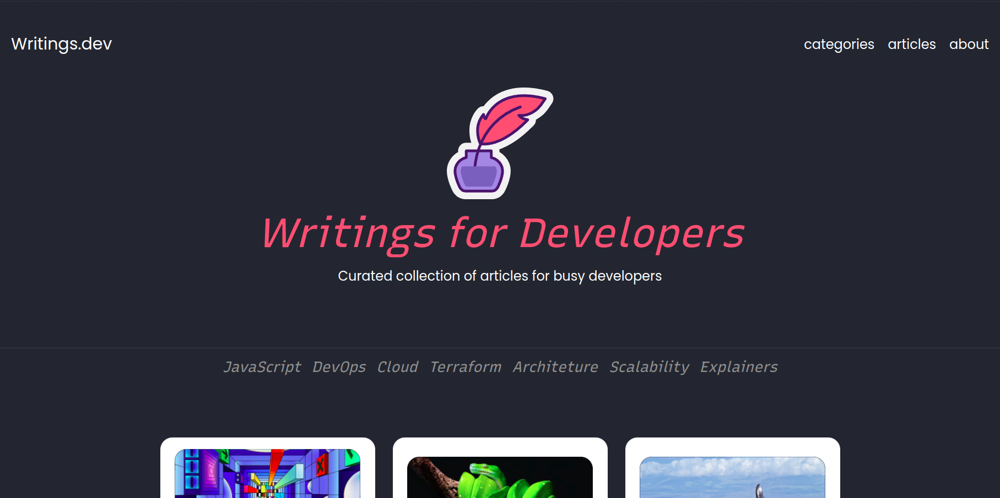
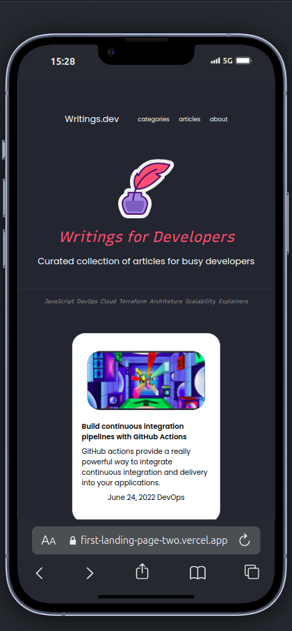

# Primeira Landing Page

Este projeto marca um passo importante na minha jornada como desenvolvedor Front-end. Foi minha primeira landing page, onde consegui consolidar conceitos essenciais como Flexbox, Grid Layout, responsividade e HTML semântico.

O design foi baseado em um layout do Figma, e também explorei transições e animações simples para criar uma experiência mais agradável ao usuário. Este projeto reflete meu progresso inicial e meu compromisso em evoluir continuamente na área de desenvolvimento web. **<a href="https://www.figma.com/design/nh0V05z3NB87ue9v5PcO3R/writings.dev?node-id=0-1&node-type=canvas&t=Alehgj7YwGDzVqTH-0" target="_blank">Figma</a>**:



Procurando seguir a semântica no código Html e estilizar da forma mais otimizada possível com Sass.
Além de treinar a responsividade.



## 🚀 Começando

Essas instruções permitirão que você obtenha uma cópia do projeto em operação na sua máquina local para fins de desenvolvimento e teste.

Consulte **[Clonando o projeto](#-clonando-o-projeto)** para saber como implantar o projeto.

## 🔧 Clonando o Projeto

### 1. Primeiro passo

Clone o reposítorio para seu ambiente local

```bash
git clone https://github.com/Le-Jr/desafio-vaiNaWeb-loreal.git
cd desafio-vaiNaWeb-loreal
```

### 2 Editando o projeto

Abra o projeto no seu editor de código e edite o projeto a sua maneira

## 🛠️ Construído com

Tecnologias utilizadas no projeto:

[](https://skillicons.dev)

- [Html](https://developer.mozilla.org/en-US/docs/Web/HTML) - Usado para construir separar o conteúdo da página
- [Sass](https://developer.mozilla.org/en-US/docs/Web/CSS) - Pré-processador Css utilizado para estilização
- [VS Code](https://code.visualstudio.com/) - IDE para construir a aplicação

## ✒️ Autor

<table>
  <tr>
    <td align="center">
      <a href"https://github.com/Le-Jr" title="Link Perfil Git Hub">
        <br>
        <sub>
          <b>Leandro Junior - Le-Jr</b>
        </sub>
      </a>
    </td>
</table>

---

⌨️ com ❤️ por [Leandro Junior](https://github.com/Le-Jr) 😊
